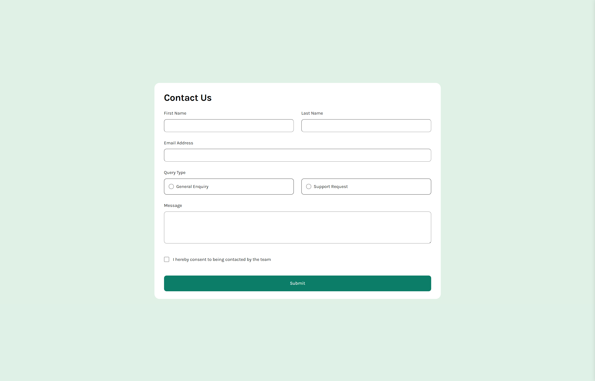

# Frontend Mentor - Contact form solution

This is a solution to the [Contact form challenge on Frontend Mentor](https://www.frontendmentor.io/challenges/contact-form--G-hYlqKJj). Frontend Mentor challenges help you improve your coding skills by building realistic projects. 

## Table of contents

- [Overview](#overview)
  - [The challenge](#the-challenge)
  - [Screenshot](#screenshot)
  - [Links](#links)
- [My process](#my-process)
  - [Built with](#built-with)
  - [What I learned](#what-i-learned)
  - [Continued development](#continued-development)
  - [Useful resources](#useful-resources)
- [Author](#author)

## Overview

### The challenge

Users should be able to:

- Complete the form and see a success toast message upon successful submission
- Receive form validation messages if:
  - A required field has been missed
  - The email address is not formatted correctly
- Complete the form only using their keyboard
- Have inputs, error messages, and the success message announced on their screen reader
- View the optimal layout for the interface depending on their device's screen size
- See hover and focus states for all interactive elements on the page

### Screenshot

### Links

- Solution URL: [Add solution URL here](https://github.com/antoniomontoia/contact-form-main)
- Live Site URL: [Add live site URL here](https://antoniomontoia.github.io/contact-form-main/)

## My process

### Built with

- Semantic HTML5 markup
- CSS custom properties
- Flexbox
- CSS Grid
- JavaScript

### What I learned

During the development of the contact form project, I managed to learn a few things:

Form assembly and validation: Since it was my first time building a form, I had to figure out to use these new elements in a valid and structured way. I also learned how to implement a bit of client-side form validation using JavaScript. This included checking for required fields, validating email formats, and ensuring that users select a query type. This experience reinforced the importance of providing immediate feedback to users to enhance their experience.

### Continued development

I would like to keep exploring the possibilities of JavaScript and CSS to improve the user experience and accessibility of the contact form. Doing it all from scratch was a great learning experience, but I'm sure there are many ways to improve it, since I left some objectives unfulfilled, such as the use of custom radio buttons and checkmarks.

### Useful resources

- [How to build forms with vanilla JS](https://thelinuxcode.com/how-to-build-and-validate-beautiful-forms-with-vanilla-html-css-javascript/) - This helped me laying the groundwork for the form structure and validation.

## Author

- Frontend Mentor - [@antoniomontoia](https://www.frontendmentor.io/profile/antoniomontoia)
- Dribbble - [@franissimo](https://www.twitter.com/franissimo)
